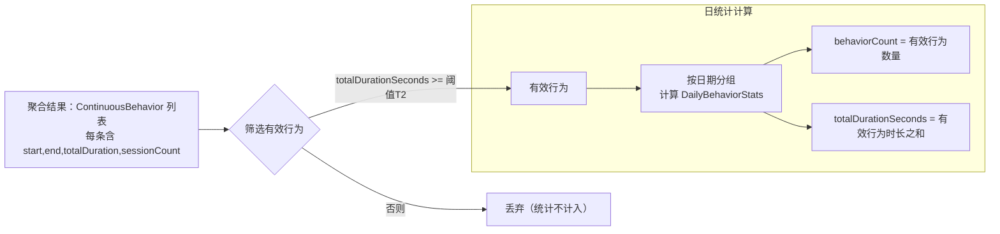

# MilkMilk 🥛

## 项目简介 📖
- Milk Milk 是一个 Android 平台的冲冲记录器。
- 95%的代码由ai编写，核心逻辑由本人编写并校验逻辑准确性。
- 灵感来自 “勇敢牛牛” ---一款在苹果手表的软件

## 核心功能 🚀
- 使用行为采集：基于系统应用事件，记录自定义应用的前台使用行为。
- 数据聚合统计：按日/周/月/年聚合使用次数，支持年度总览。
- 可以配置自定义的手冲用app，并支持多个app来回切换合并计算到一个冲冲行为。
- 可自定义配置记录阈值：应用切换阈值、有效行为时长阈值。

## 运行逻辑图 🧠

## 主要模块 🧩
- `app/src/main/java/com/dazo66/milkmilk/MainActivity.kt`：入口 Activity 与页面容器。
- `app/src/main/java/com/dazo66/milkmilk/MainViewModel.kt`：业务状态与统计数据管理。
- `app/src/main/java/com/dazo66/milkmilk/ui/StatisticsTab.kt`：统计页 UI 与交互逻辑。
- `app/src/main/java/com/dazo66/milkmilk/ui/HeatmapView.kt`：热力图组件（日/周/月/年视图）。
- `app/src/main/java/com/dazo66/milkmilk/service/AppMonitorService.kt`：使用行为采集服务（可访问性）。

## 权限与配置 🔧
- 由于采用可访问性服务进行行为采集，首次运行需要在系统设置中启用本应用的“辅助功能”权限。
- 你可以在应用内选择需要监控的应用列表，统计页会围绕该列表生成热力图与详情。

## 关于本项目 🎯
- 本人本职工作是一位后端开发，没有多少审美，如果有人愿意优化UI非常欢迎发起pr。
- 由于之前没做过安卓开发，这个项目的性能优化应该还有很大的空间，但是我不知道如何去优化了，也欢迎给我提pr。
- 如果对你有帮助欢迎给我点个star。

## 许可证 📜
- 本项目采用 `PolyForm Noncommercial License 1.0.0`（非商用许可）。
- 非商用使用均被允许；任何商业用途不被允许。
- 需保留许可条款与署名信息（见仓库根目录 `LICENSE` 与 `NOTICE`）。
- 许可证官方文本：`https://polyformproject.org/licenses/noncommercial/1.0.0/`。
- 若你需要商业授权，请联系维护者以获取单独授权。

---
ℹ️ 如需进一步的功能说明、性能优化或贡献指南，欢迎提出 Issue 或发起 PR。
